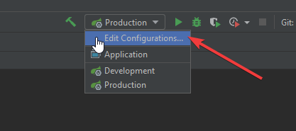

# Environment Variables to Connect To Database

## Intro

A common way to handle secret connection credentials in an app is through environment variables. These can be set per user and also on the production server independently, and are not tracked by version control (which is a good thing).

I'm going to tell you how to set your environment variables in IntelliJ so the app server running on your machine will connect to the AWS MySQL database.

## 1. Open configuration editor

Near the upper right of your IntelliJ window you'll see a dropdown which might say "Application" or something. Drop down that menu and click "Edit Configurations...". See figure below.
    

## 2. Edit your configs

You can have just one configuration or multiple (see arrow 1 in the figure below). You'll see I have two, one of them connects to my local MySQL instance and the other is hooked up to AWS. If you don't want to have a local instance that's fine, it requires a little more work but I'll be happy to walk you through that if that's something you want. It's not difficult but I won't include instructions to do that for now.

*Anyway,* in this editor, make the following changes:
 - (Optional, see arrow 2) add this to your vm options if you want to be able to hit breakpoints while debugging: `-Dspring-boot.run.fork=false`
 - (See arrow 3) This is the important part: add the environment variables. I'm not going to include them in this document, I'll message them to you on discord. If you lose them, just ask on there. NEVER POST THESE ANYWHERE PUBLICLY. Even here on Github even though our repo is private.
 

## 3. That's it

Go ahead and compile/run your configuration. Once you local server is running hit [the sandbox](http://localhost:8080/sandbox) and try entering some stuff. If the data persists and all of us can see the entities, you dun good.

Let me know if you run into any issues.