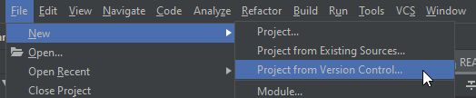
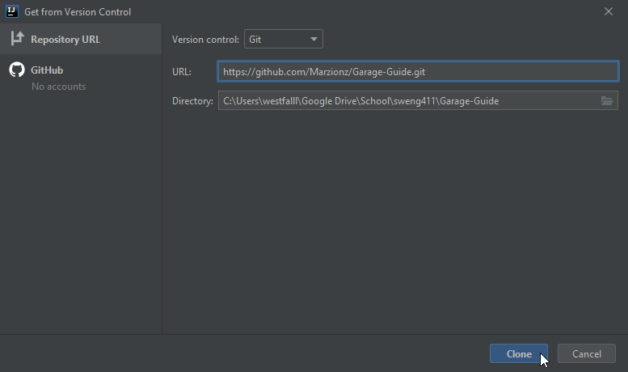
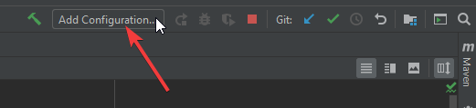
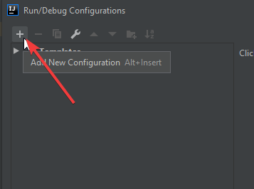
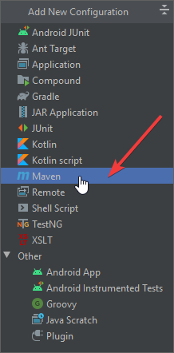
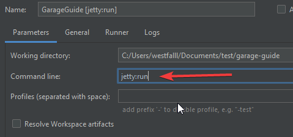

# Developer Guide

Here are some basic instructions on how to get started with development for GarageGuide.
These instructions are written for IntelliJ, they will vary a bit from other IDEs.
Let's use this document to help, uh, document anything related to our development environments and notes about working in Git.

## Local Repo Setup

1. Clone the repository [using the CLI (command line interface)](https://docs.github.com/en/github/creating-cloning-and-archiving-repositories/cloning-a-repository)
    
    ```
    git clone https://github.com/Marzionz/Garage-Guide.git
    ```
    
    The above command will create a folder named Garage-Guide in whatever your working directory is and download the entire source file.

2. Open IntelliJ.
3. File -> Open, navigate to where you performed step 1 above and find the Garage-Guide folder, open that project.

**OR**

Using IntelliJ's interface:





If you don't have git installed, download and install it from [here](https://git-scm.com/download) first.

## Install Node.js and NPM

1. [Download](https://nodejs.org/en/) and install Node.js if you don't already have it.
2. After installation, verify npm is properly installed by opening a command prompt and typing `npm -v`. It should print the npm version.

## Configure IntelliJ Run/Debug

1. In upper-right corner you should see "Add Configuration..." near the debugger controls. Click that.
    
    
2. Click the add (+) in the upper-left corner of the dialog that just opened up.
    
    
3. Select "Maven".
    
    
4. On the right side of the dialog, in the command line input, type "jetty:run" (without quotes).

    
5. Click Ok to close the dialog.
6. Do a test run, click the green play button in the upper right. If you didn't 

    Keep an eye on the "Run" output at the bottom of the screen. Eventually you'll see some text similar to the below:
    ```
     Vaadin is running in DEBUG MODE.
     When deploying application for production, remember to disable debug features. See more from https://vaadin.com/docs/
    ```
   **Note: You might see some red text - they might not be errors so don't be immediately alarmed.**
7. Once you see the above text, try opening a browser (anything except internet explorer...) and browse to http://localhost:8080
   
   I should've put some hello world text in there, my bad... You should see a blank screen, except for an install button at the bottom of the page.
   
   If you see this, you should be all set.
   
   
   
## Using Git

If you're at all unfamiliar with Git, I strongly recommend checking out some youtube tutorials or websites. Here are some tips of my own:

- Never work directly on master. Start a new branch to work on features or bugs. Don't forget to checkout the new branch. Eg:
    ```
    git branch new-feature
    git checkout new-feature
    ```
    (change "new-feature" to whatever the name of your branch is)
    
    When you want to push your new branch (presumably after you've made commits), you'll have to run this (only on the first push for that branch):
    ```
    git push --set-upstream origin new-feature
    ```
    (change "new-feature" to whatever the name of your branch is)
- Never force push `git push --force`. If you get errors trying to push, something's wrong. It can probably be fixed with `git pull` if someone else has pushed since your last fetch/pull.
- Avoid doing a ton of unrelated work in a single commit, try to make one commit touch only a single bug or feature at a time.
    If you touched a few different things that's okay. When staging your changes before you commit and you want to split into multiple commits, use `git add -p` instead of `git add .` or similar.
    This allows you to select which hunks of code get staged for the next commit. I do this pretty much all the time.
- Always include commit messages, eg: 

    `git commit -m "This is a commit message, I did xyz"`
    
    If you want to be more detailed with your messages, try:
    
    `git commit -m "This is a commit message, it should be short" -m "Here are more details about this commit, this can be longer" -m "I can do this as many times as I want to add more lines to the message."`
- If you're a git beginner, I guarantee you'll get frustrated and confused at times. There is a learning curve. Reach out in discord if you get stuck.
