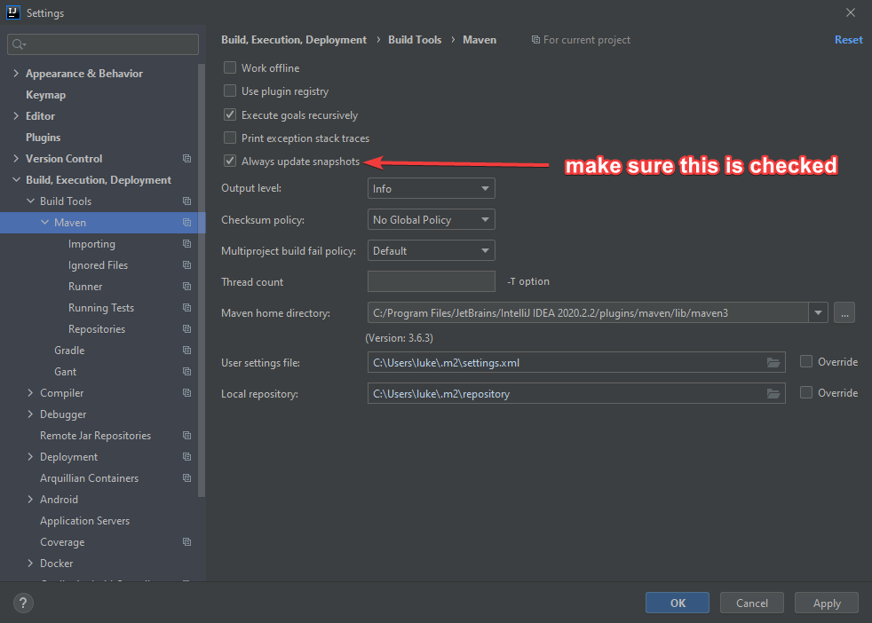

# Troubleshooting

This document is reserved for any common issues we might run into with our dev environments, Git, etc.

## Dependency Issues

I ran into these a lot early on and they drove me nuts until I set this option; the issues seem to have gone away, I recommend everyone do the following in their IntelliJ ASAP:

1. File -> Settings
2. Build, Execution, Deployment -> Build Tools -> Maven
3. Make sure **Always update snapshots** is checked.



## Exception When Running/Debugging: "java.io.InvalidClassException"

You might sometimes get something similar to the following after you startup your local server via run or debug:
```
java.io.InvalidClassException: com.TeamOne411.ui.view.registration.RegisterView; local class incompatible: stream classdesc serialVersionUID = -8128403993699618974, local class serialVersionUID = -3908885024204167167
```

As far as I can figure out, this is normal and nothing to worry about. The application should still run fine. For a more technical explanation see:
https://stackoverflow.com/questions/33413139/vaadin-serializable-errors-on-tomcat
